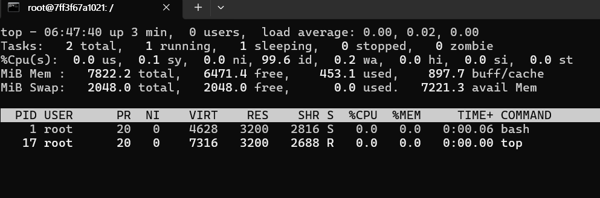
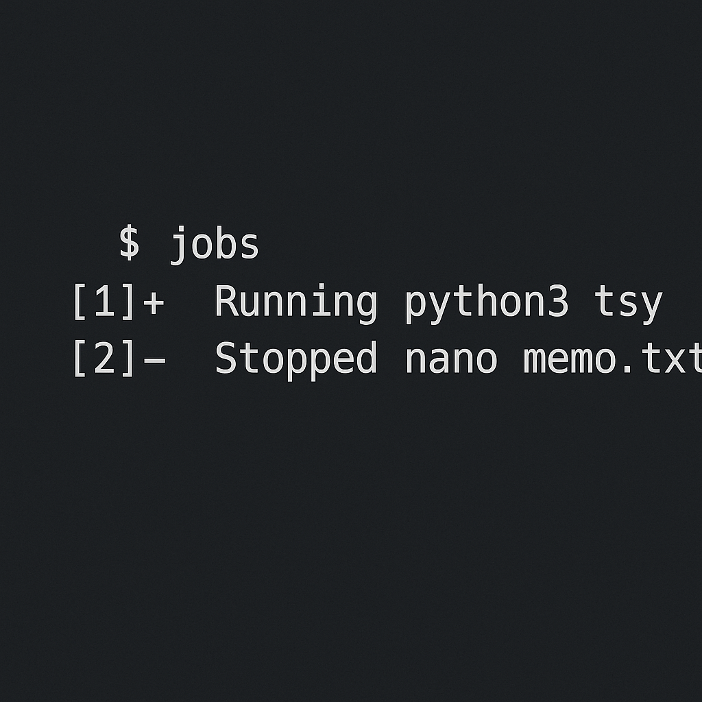

# Homework 2

학과: 컴퓨터공학과

학번: 20203199

이름: 박준형

1. 리눅스 명령어 ***top***

##### ***top***은 리눅스에서 현재 시스템의 프로세스, CPU 사용량, 메모리 상태 등을 실시간으로 모니터링하는 명령어다.
---
- 실행화면에서 보이는 주요항목

 
| 항목               | 의미                                            |
| ---------------- | --------------------------------------------- |
| **uptime**       | 시스템 부팅 후 경과 시간                                |
| **load average** | 1/5/15분 시스템 평균 부하                             |
| **Tasks**        | 실행 중 / 중지 / 좀비 프로세스 수                         |
| **CPU 사용량**      | us(사용자), sy(커널), id(대기), wa(I/O 대기), st(스틸타임) |
| **Memory**       | 전체/사용/여유 메모리                                  |
| **Swap**         | 전체/사용/여유 스왑                                   |

- ***top*** 명령어 실행 예시

2. 리눅스 명령어 ***ps***

##### ***ps***는 Process Status의 약자로, 리눅스에서 실행 중인 프로세스들의 정보를 한 번에 출력하는 명령어다.
---

- ps출력 기본정보

| 컬럼      | 의미                |
| ------- | ----------------- |
| USER    | 실행한 사용자           |
| PID     | 프로세스 ID           |
| %CPU    | CPU 사용 비율         |
| %MEM    | 메모리 사용 비율         |
| VSZ     | 가상 메모리 크기(KB)     |
| RSS     | 실제 물리 메모리 사용량(KB) |
| STAT    | 상태 (실행, 대기, 좀비…)  |
| START   | 시작된 시간            |

3. 리눅스 명령어 ***jobs***

##### ***jobs*** 명령어는 쉘(session)에서 실행 중인 백그라운드 작업들의 목록을 보여주는 명령어다. 터미널에서 실행한 작업을 앞/뒤로 보내거나 중지하고 재개할 때 사용하는 기능으로 bash, zsh와 같은 쉘에서만 동작하는 기능이다.
---

- ***jobs*** 명령어 실행 예시

- 각 부분 의미

| 항목      | 의미                              |
| ------- | ------------------------------- |
| `[1]`   | job 번호                          |
| `+`     | 기본(default) job (fg, bg 명령의 대상) |
| `-`     | 그 다음 우선순위 job                   |
| Running | 실행 중                            |
| Stopped | 중지(Suspended, Ctrl+Z)           |
| 명령어     | 실제 실행한 작업                       |      

4. 리눅스 명렁어 ***kill***

##### ***kill*** 명령어는 특정 프로세스에 시그널(signal) 을 전달하기 위해 사용되는 도구이다. 다양한 종류의 시그널을 전달하여 프로세스의 동작을 제어하는 역할을 수행한다. 종료 요청 또한 여러 시그널 중 하나일 뿐이며, 그 외에도 일시 중지, 재개, 재설정 등 다양한 동작을 유도할 수 있다.

---

- ***kill*** 명령어 주요 시그널

옵션없이 ***kill PID***를 입력하면 기본적으로 SIGTERM(15)가 전달된다. 이는 프로세스에 종료를 요청하는 시그널로, 프로세스가 파일 정리, 자원 반환 등 종료 절차를 수행할 수 있는 시간을 부여한다. 

리눅스에서 사용 가능한 시그널은 ***kill -l*** 명령어로 목록을 확인할 수 있다.

| 시그널     | 번호 | 의미                    |
| ------- | -- | --------------------- |
| SIGTERM | 15 | 정상 종료 요청(기본값)         |
| SIGKILL | 9  | 강제 종료(프로세스가 처리할 수 없음) |
| SIGINT  | 2  | 인터럽트(`Ctrl + C`와 동일)  |
| SIGHUP  | 1  | 연결 종료, 데몬 설정 재로딩 시 활용 |
| SIGSTOP | 19 | 프로세스 일시 중지            |
| SIGCONT | 18 | 중지된 프로세스 재개           |

